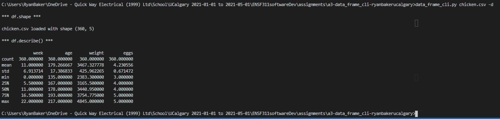

# a3-data_frame_cli
Create a command line interface to common Pandas DataFrame methods for inspecting csv files.

# Problem statement
With data in a csv file, Pandas DataFrame methods can be used for inspection. These are common steps:
1. Check dimension `df.shape`
2. Peek at the first rows `df.head()`
3. Get info on data types and missing values `df.info()`
4. Summarize columns `df.describe()`
5. Get unique values of a column `df[col].unique()`
6. Plot histogram of values in a column `df[col].hist()`, either display or save plot to file.


The goal is to write a Python program with a command line interface able to load a csv file and provide command line options for the steps outlined above. In essence, the program is a wrapper for Pandas DataFrame methods.

The program:
- takes a filename as a required argument and prints the dimension of the data loaded. 
- provides optional arguments for steps 2., 3. and 4. (see above). 
- (optional) provides optional arguments for steps 5. and 6. (see above).

The final program provides the following interface:

```
$ python data_frame_cli.py -h
usage: data_frame_cli.py [-h] [-t] [-i] [-d [COLUMN_NAME]]
                             [-u COLUMN_NAME] [-p COLUMN_NAME] [-o FILENAME]
                             csv_filename

Inspecting csv files with Pandas DataFrame methods.

positional arguments:
  csv_filename          A (nice) csv file.

optional arguments:
  -h, --help            show this help message and exit
  -t, --head            print dataframe head.
  -i, --info            print dataframe info.
  -d [COLUMN_NAME], --describe [COLUMN_NAME]
                        Print dataframe statistics. If COLUMN_NAME provided,
                        print statistics of selected column only.
```

Note that step 4 _summarizing columns_ using `df.describe()` is activated with `-d` or `--describe`. This argument can, optionally, take a column name, in which case `df.describe()` is applied to the corresponding column only, e.g. `-d weight` would print summary statistics of the `weight` column only (if the column exists).

# What to do
The file `data_frame_cli.py` provides initial code that creates an `ArgumentParser` for the required filename argument, followed by printing the data's shape, if loading was successful. Extend the code in this file and implement command line options for steps 2., 3. and 4. as outlined above. Optionally implement steps 5. and 6.

Follow the [Style Guide](StyleGuide.md), and use git and github to track your changes.

Edit `README.md` (this file) and include screenshots of your final program in the _Program documentation_ section below. Use `chicken.csv` as sample data and match the screenshot to each of the documentation headings.

In the section *Test results*, include a screenshot of running `pytest`.

In the section *Reflection*, include what you liked or disliked; found interesting, confusing, challenging, motivating while working on this assignment.

Make sure final version of your code and documentation files are committed to git and pushed to github. 

# Program documentation

## Getting information on data in csv file (`-i`)
```bash
$ python data_frame_cli.py chicken.csv -i

*** df.shape ***

chicken.csv loaded with shape (360, 5)

*** df.info() ***

<class 'pandas.core.frame.DataFrame'>
RangeIndex: 360 entries, 0 to 359
Data columns (total 5 columns):
week      360 non-null int64
age       360 non-null int64
diet      360 non-null object
weight    360 non-null float64
eggs      360 non-null int64
dtypes: float64(1), int64(3), object(1)
memory usage: 14.2+ KB
```


## Printing the first 5 rows of the csv file (`-t`)
```bash
python data_frame_cli.py chicken.csv -t

*** df.shape ***

chicken.csv loaded with shape (360, 5)

*** df.head() ***

   week  age diet  weight  eggs
0     0  147    A  3106.2     4
1     0  157    A  2891.7     5
2     0  163    A  2958.3     4
3     0  145    A  3188.7     5
4     0  162    A  3491.7     5
```


## Printing statistics of all numerical columns (`-d`)
```bash
python data_frame_cli.py chicken.csv -d

*** df.shape ***

chicken.csv loaded with shape (360, 5)

*** df.describe() ***

             week         age       weight        eggs
count  360.000000  360.000000   360.000000  360.000000
mean    11.000000  179.266667  3467.327778    4.230556
std      6.913714   17.386833   425.962265    0.671472
min      0.000000  135.000000  2383.300000    3.000000
25%      5.500000  167.000000  3165.500000    4.000000
50%     11.000000  178.000000  3440.950000    4.000000
75%     16.500000  193.000000  3754.775000    5.000000
max     22.000000  217.000000  4845.000000    5.000000
```




## Printing statistics of a single column (`-d column_name`)
```bash
python data_frame_cli.py chicken.csv -d diet

*** df.shape ***

chicken.csv loaded with shape (360, 5)

*** df[diet].describe() ***

count     360
unique      3
top         B
freq      120
Name: diet, dtype: object
```


# Test results


# Reflection
- I enjoyed this exercise! It went pretty well, with the exception of pytest causing an error. However, after the email was sent out to modify the pytest file, everything went well.
- I added another feature: statistics of any number of numerical columns. See the example below.
- In order to get this feature to work, I needed to make `nargs='*'` for `add_arguments('-d')`. This however, caused pytest `test_print_describe_none_column()` to fail, because a string was used instead of a list object. I just cheated and passed pytest with an additional `elif:` statement, so that this could be easily removed. If this were not an assignment, I would have just modified pytest to pass in a list object instead of a string (because that what `parser.parse_args(args)` does).

Screenshot of added feature:


